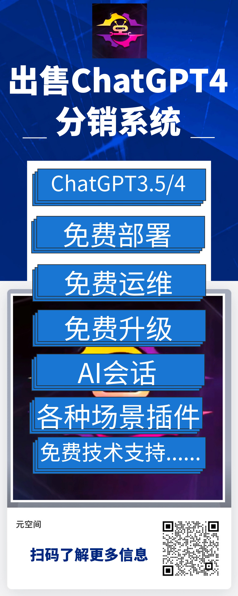
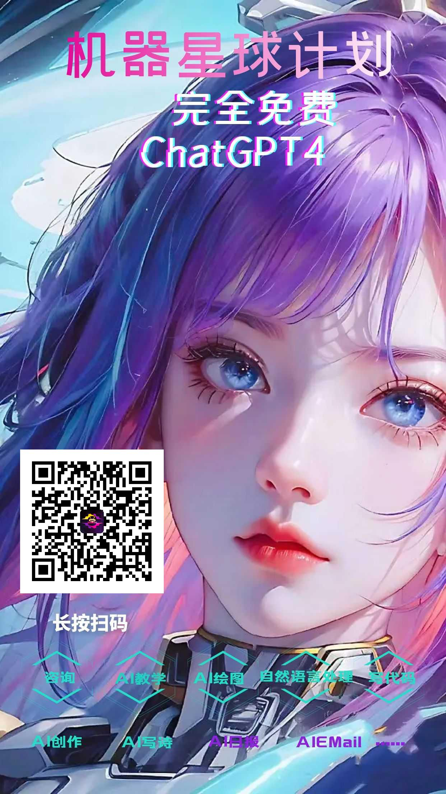
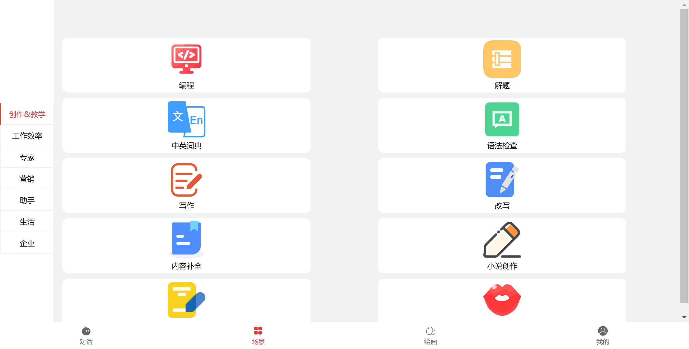
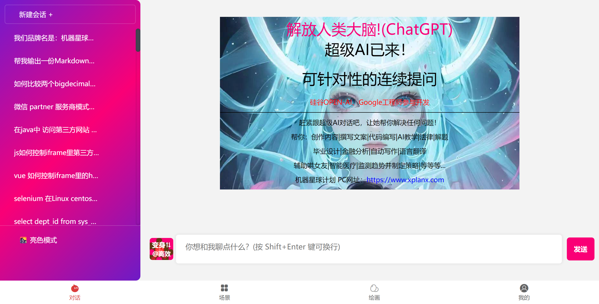
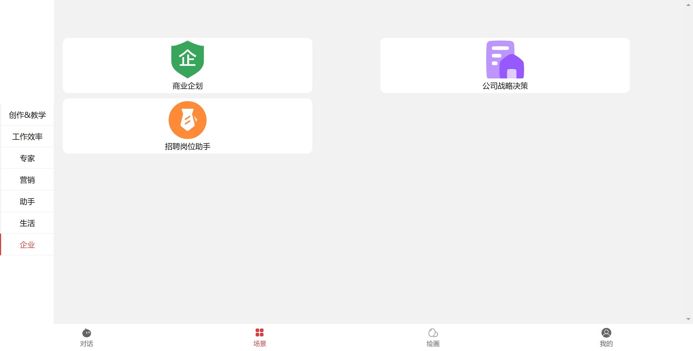
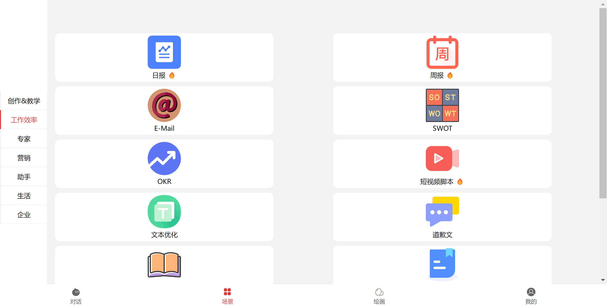
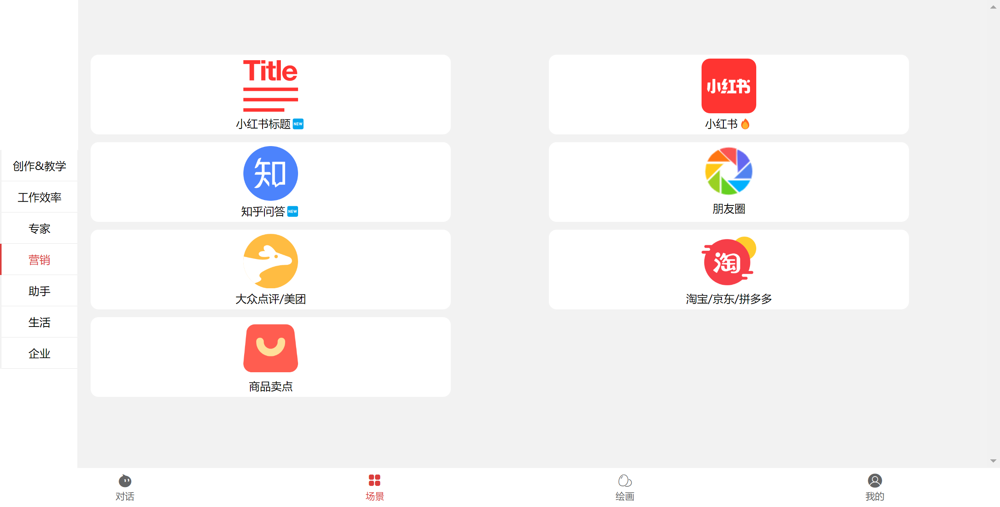

## 出售带分销的ChatGPT系统

## ChatGPT: 一个强大的对话生成模型
**ChatGPT是一种新型的对话生成模型，它采用了GPT技术来生成高质量的、流畅的自然语言对话。可以用于聊天机器人、个人助理、客服机器人等领域。**

## 特点
+ 支持多种自然语言：
  ChatGPT支持多种语言的生成，可以使用英文、中文、西班牙文、法语、德语等等。

+ 自然流畅的对话：ChatGPT能够根据上下文自然地生成流畅的对话。

+ 高效的处理能力：ChatGPT能够快速地处理大量的文本，支持多线程并发处理。

+ 可定制性高：ChatGPT的生成模型可以通过训练进行优化，使其能够适应新的对话场景。

+ 应用领域
  ChatGPT可以应用于多种领域，如：

+ 聊天机器人 个人助理
  客服机器人
  智能客服
  社交媒体聊天
+ 欢迎来到机器星球计划，这是一个基于ChatGPT搭建的 AI 系统。我们在这个星球上有着许多应用场景，其中包括 AI 绘画。通过机器星球计划，您可以和这个系统进行互动，尝试出色的 AI 绘画体验。我们提供了许多不同的功能，可以让您在绘画过程中体验到更多的乐趣。这是一个非常有趣的计划，期待您的加入！
## 如何使用？
## 完全免费：

+ 获取帮助
  您可以访问"机器星球计划"的官方网站直接链接：<https://www.xplanx.com/>，了解更多关于ChatGPT的资料和使用方法。同时，"机器星球计划"也提供了详细的文档和技术支持服务，可以帮助您解决各种使用中遇到的问题。
